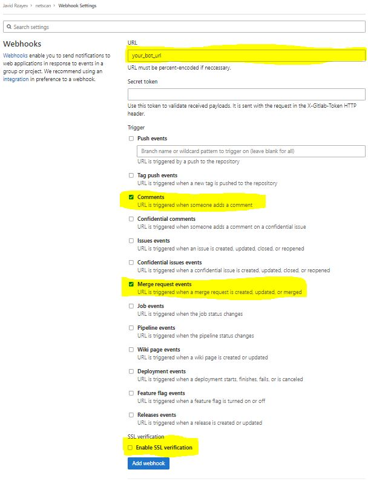
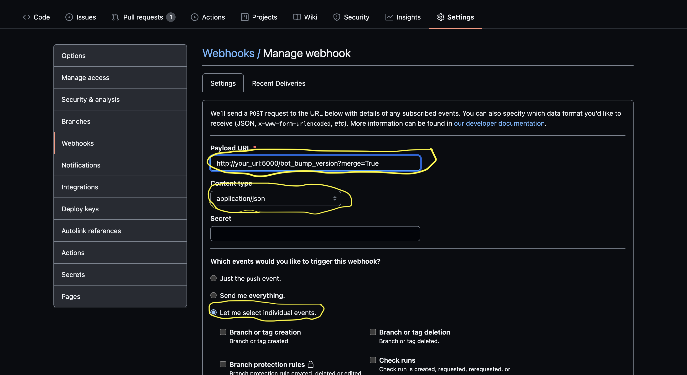

# Version Bump
Simple Python Bot to automate Version-Bumping of your VCS hosted Microservice


## Run in docker
- docker run -d -v $(pwd)/config.yaml:/etc/version-bump/config.yaml -p 5000:5000 javid907/bump-version-bot:latest


## Webhook POST request:
Example:
  - http://127.0.0.1:5000/bot_bump_version

If you want bot to merge you need to add `merge=True` parameter in your webhook request
Example:
  - http://127.0.0.1:5000/bot_bump_version?merge=True


## Supported microservice syntax
- Elixir
- TypeScript
- JavaScript
- Kotlin
- Python
- Smarty
- Dockerfile
- Lua
- Chart
- Java
- Vue
- NextJS
- NodeJS

## GitLab WebHook installation

Please go to this path: Setting >> Webhooks
  


## GitHub WebHook installation

Please go to this path: Setting >> Webhooks >> Add webhook
  

Choose these events:
- Issue comments
- Pull requests

## Bot Behaviour
When an MR is assigned to the bot it will bump the version if necessary. The bot can add a CHANGELOG.md entry when
instructed to do so via MR description.

### Assigning the MR to the bot
The bot will automatically bump the version, and merge if configured to do so, when the MR is assigned
to the bot. For this to work the MR title must follow the convention that it begins with either 'fix/'
or 'ft/'. 'fix/...' will result in a patch bump. 'ft/...' will result in a minor version bump.

#### Bumping the Major version
If you want to bump the major version the only way to achieve this is to write a comment in your MR
'@bump-bot major'.

### Bumping the Version without assigning to the Bot
The Bot will bump the version when a comment is written in the MR and will adjust the version according
to the last issued comment.

#### Supported Commands
##### Bump Version
- @your_bot_username patch
- @your_bot_username minor
- @your_bot_username major

##### Merge to Destination
- @your_bot_username merge

##### Send help notification to DevOps Group
- @your_bot_username help

##### Rebase with Destination
- @your_bot_username rebase destination_branch_name {patch|minor|major}

If you will not write `destination_branch_name` bot will use `DEFAULT_BRANCH`

### Adding a CHANGELOG.md entry
The bot respects the 'Keep a Changelog' format (1.0.0) and will add the correct version and date header automatically.

To have the bot add a complete changelog entry add 'BEGIN CHANGELOG' and 'END CHANGELOG' delimiters to the MR description.
You can change these keys via `config.yaml`.
Example:
```
BEGIN CHANGELOG
### Added
- python 3.9.7 interpreter as python3.9
### Changed
- Update bash to 5.1
### Removed
- Shell support. No more /bin/sh support use /bin/bash. It's 2021!.
END CHANGELOG
```

Note: When using MR description with above mentioned delimiters for the new changelog entry, the bot will overwrite all manual changes to CHANGELOG.md.

## Known limitations
If the master branch of a project does not yet contain files which the bot can use to decide what type
of project it is facing it will state that there is nothing for it to do. Only after the files exist in
both branches can the bot decide which version to bump.
